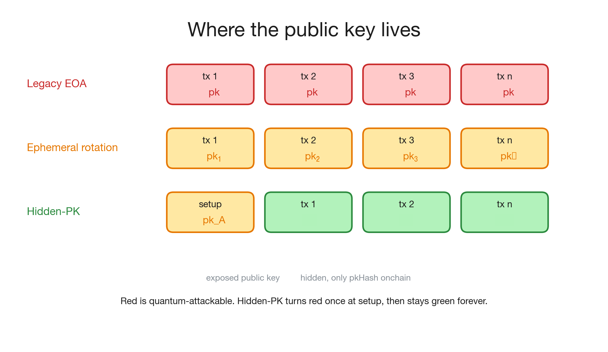

# Post-Quantum Ethereum Wallets via Hidden Public Keys and EIP-7702 Delegation

*Implementation: [github.com/SoundnessLabs/longfellow-zk-hiddenpk](https://github.com/SoundnessLabs/longfellow-zk-hiddenpk)*

---

## TL;DR

- Any Ethereum EOA that has transacted has its secp256k1 public key permanently on-chain and is quantum-vulnerable today.
- A single EIP-7702 transaction retrofits the existing EOA to post-quantum security with no address change, no asset migration, and no consensus modification.
- The EOA installs a `GatedWallet` contract that accepts only ZK proofs of ECDSA knowledge under a **hidden public key**. That key never appears on-chain at any point.
- A working C++ implementation over secp256k1 using Longfellow-ZK (Ligero, hash-only, post-quantum sound) benchmarks at **87 ms prove / 65 ms verify / 226 KB proof** on Apple M1. An independent Rust port is available at [github.com/abetterinternet/zk-cred-longfellow](https://github.com/abetterinternet/zk-cred-longfellow).
- We identify a **designated-prover ECDSA** optimization: because the prover is also the signer, the verification path collapses from two variable-base MSMs to two fixed-base ones, with an estimated 3-5x constraint reduction.
- This work extends [quantum-proof keypairs with ECDSA-ZK (ethresear.ch, 2022)](https://ethresear.ch/t/quantum-proof-keypairs-with-ecdsa-zk/14901) and fills in the delegation and verification flow that was left open there.

---

## 1. Problem

Every Ethereum account that has ever sent a transaction has its secp256k1 public key permanently recoverable from the blockchain. Shor's algorithm extracts the private key from that public key in polynomial time on a cryptographically-relevant quantum computer (CRQC). NIST completed its PQC standardization in 2024. Harvest-now-decrypt-later timelines are actively shortening.

The standard answers all have a high cost of entry:

| Approach | Address change | Asset migration | Consensus change | Public key exposed |
|---|---|---|---|---|
| Migrate to PQ address | Yes | Yes | Yes | Once |
| Ephemeral key rotation [1] | No | No | No | Every tx |
| New PQ smart wallet | Yes | Yes | No | Once |
| **This work** | **No** | **No** | **No** | **Setup only** |

Ephemeral key rotation [1] is the closest prior construction. The address stays constant, and the authorized signer rotates in smart contract storage after each transaction. The gap: each transaction must broadcast the current public key in the mempool, leaving a window where a CRQC can extract the private key before rotation lands. In the construction described here, the hidden public key never appears anywhere.

---

## 2. Why Not Post-Quantum Signatures

Falcon, Dilithium (ML-DSA), and SPHINCS+ are the right long-term answer. They are also unavailable to most Ethereum wallets today, and not for lack of trying.

The core problem is the infrastructure layer beneath the wallet software. Most institutional and consumer wallets rely on either hardware security modules (HSMs) or multi-party computation (MPC) protocols for key management. Current-generation HSMs support ECDSA, RSA, and EdDSA. They do not support lattice-based or hash-based signature schemes, and the hardware update cycle for HSM vendors runs two to five years. MPC wallets face a harder version of the same problem: threshold ECDSA has been worked on for over a decade and has well-audited protocols (GG18, CGGMP21). Threshold ML-DSA exists in research, but production-grade, audited threshold implementations are not deployed at scale.

Beyond the HSM and MPC layer, a PQ migration requires new address schemes, consensus-level changes, updated wallet interfaces across every client, and new calldata economics for larger PQ signatures (ML-DSA signatures are 2.4-3.3 KB versus 65 bytes for ECDSA).

The hidden-PK construction described here does not replace ECDSA. It wraps it. The HSM or MPC system continues to run ECDSA internally. The ZK proof layer sits above that, in wallet software, and the on-chain verifier only sees a proof that the ECDSA signing happened correctly under a committed key. Nothing below the wallet software changes. This is the fastest path to quantum safety for MPC and HSM wallets in production today.

---

## 3. Prior Work and What Was Missing

The 2022 ethresear.ch post [2] identified the right goal: prove ECDSA signature knowledge without revealing the public key. Two things were left open:

1. **The delegation flow.** How does the proof connect to the existing EOA's assets, and what is the on-chain gating mechanism?
2. **The proof system choice.** What ZK backend is usable? Groth16 and KZG-PLONK are not post-quantum sound.

PSE's [zkID project](https://github.com/privacy-ethereum/zkID) is solving the same problem from the identity angle: ZK proofs over ECDSA credentials for privacy-preserving identity on Ethereum. Their circuit work demonstrates that ECDSA-ZK is operationally practical today. The ZK identity stack that zkID has built, including verifier contracts, mobile-side proving libraries, and standardized proof formats, is directly reusable for the hidden-PK wallet construction described here. This is why the proposal is deployable now. A wallet vendor integrating zkID's ECDSA-ZK circuits gets both identity and quantum-safe transaction authorization from the same codebase.

This post fills the delegation and verification gaps with a concrete construction.

---

## 4. Construction

### 4.1 Setup: one transaction

The user's existing EOA `A` signs a single EIP-7702 authorization pointing to a `GatedWallet` contract. This is the last time `sk_A` is used for normal spending.

```
EIP-7702 SetCode authorization:
  chain_id  ||  address(GatedWallet)  ||  nonce_A  ||  sig_A
```

After this lands, any call to `addr_A` executes `GatedWallet` code. The contract's state at `addr_A`'s storage slots holds one value:

```
pkHash_B = H(pkx_B || pky_B)
```

where `pk_B` is the user's new hidden keypair, generated off-chain and never broadcast.

**Note on hash function (WIP).** The current implementation uses SHA-256 for `pkHash_B` because Longfellow-ZK does not yet support Keccak inside circuits. Ethereum's native address scheme uses Keccak-256. Adding Keccak support to Longfellow is ongoing work and will tighten the alignment with Ethereum's existing commitment scheme once complete.

### 4.2 Steady state: ZK-gated execution

Every subsequent transaction:

1. The user's wallet generates a ZK proof $\pi$ on-device, proving:
   $$\exists\, (pk_B, r, s) \;\text{ s.t. }\; \mathrm{ECDSA.verify}(pk_B,\, (r,s),\, e) = 1 \;\wedge\; H(pk_B) = pkHash_B$$
   where $e = H(\mathtt{userOpHash} \;|\!|\; \mathtt{chainid} \;|\!|\; \mathtt{nonce})$ binds the proof to this specific action on this specific chain at this nonce.
2. The UserOperation (ERC-4337) carries $\pi$ in its `signature` field. A public bundler forwards it.
3. `GatedWallet.execute` calls `zkVerifier.verify(proof, pkHash_B, e)`.
4. On success, `addr_A`'s assets move per the requested action.


### 4.3 Solidity sketch

```solidity
contract GatedWallet {
    bytes32 public immutable pkHash;
    IZKVerifier public immutable zkVerifier;
    uint256 public nonce;

    constructor(bytes32 _pkHash, IZKVerifier _v) {
        pkHash = _pkHash;
        zkVerifier = _v;
    }

    function execute(
        address to, uint256 value, bytes calldata data, bytes calldata proof
    ) external {
        // EIP-7702 self-call idiom: the EOA's own signed tx sets msg.sender = address(this).
        // Any external caller has a different msg.sender and is rejected here.
        require(msg.sender == address(this), "self only");

        bytes32 e = keccak256(abi.encode(keccak256(data), block.chainid, nonce));
        require(zkVerifier.verify(proof, pkHash, e), "bad proof");
        nonce++;

        (bool ok,) = to.call{value: value}(data);
        require(ok);
    }
}
```

---

## 5. Hybrid Transition: Dual-Signature Safety Net

The construction above gives full post-quantum security once deployed. However, during an initial deployment period there is a reasonable concern: the ZK proof system (Longfellow-ZK / Ligero) has not been in production for years, and a soundness flaw in the circuit could let an attacker forge a proof and drain `addr_A`'s assets.

To address this, the `GatedWallet` can enforce both signatures simultaneously during an initial transition period:

$$\text{authorize}(\mathtt{to}, \mathtt{value}, \mathtt{data}) \iff \underbrace{\mathrm{ECDSA.verify}(pk_1,\, sig_1,\, e)}_{\text{classical check, } pk_1 \text{ exposed}} \;\wedge\; \underbrace{\mathrm{ZK.verify}(\pi,\, pkHash_2,\, e)}_{\text{hidden-key check, PQ-safe}}$$

The semantics:

- $pk_1$ is the original exposed keypair (attacker can run Shor on it, but $sk_2$ remains hidden).
- $pk_2$ is the new hidden keypair (attacker cannot run Shor because $pk_2$ is never published).
- Classical security holds as long as no CRQC exists. Post-quantum security holds even if a CRQC exists, because $pk_2$ is hidden.
- If the ZK proof system has a soundness flaw, the classical signature still prevents unauthorized spending.

```solidity
function execute(
    address to, uint256 value, bytes calldata data,
    bytes calldata zkProof,
    uint8 v1, bytes32 r1, bytes32 s1  // classical sig under pk_1
) external {
    require(msg.sender == address(this), "self only");

    bytes32 e = keccak256(abi.encode(keccak256(data), block.chainid, nonce));

    // Classical guard: original key co-authorizes during transition.
    require(ecrecover(e, v1, r1, s1) == address(this), "bad sig1");

    // ZK guard: hidden key proves knowledge without revealing pk_2.
    require(zkVerifier.verify(zkProof, pkHash2, e), "bad proof");

    nonce++;
    (bool ok,) = to.call{value: value}(data);
    require(ok);
}
```

After multiple years of deployment and independent auditing, the `ecrecover` check is removed by a fresh EIP-7702 SetCode pointing to a new `GatedWallet` without the classical guard. At that point the system transitions to pure hidden-PK security.

This layered approach separates two distinct failure modes: a quantum computer breaking ECDSA and a soundness bug in the ZK system. The dual-signature contract is robust against either one in isolation.

---

## 6. Circuit

The circuit runs over secp256k1's base field. Two sub-circuits compose:

1. **ECDSA verification sub-circuit** (`VerifyCircuit<Fp256k1Base, P256k1>`): checks the identity $G \cdot e + pk \cdot r + R \cdot (-s) = \mathcal{O}$ with private witnesses $(pk, r, s)$ and public input $e$.
2. **Hash sub-circuit** (`FlatHashCircuit`): computes SHA-256 over the 64-byte concatenation $(pkx \;|\!|\; pky)$ and checks equality to the public `pkHash`.

secp256k1's base field has $v_2(p^2-1) = 5$, which rules out standard NTT-based Reed-Solomon. The implementation uses `CrtConvolutionFactory<CRT256<Fp256k1Base>>` as the RS backend in Longfellow-ZK.


---

## 7. Designated-Prover ECDSA Optimization

### 7.1 Why the current circuit is over-specified

Standard ECDSA verification computes:
$$R = u_1 \cdot G + u_2 \cdot pk, \qquad u_1 = e \cdot s^{-1},\quad u_2 = r \cdot s^{-1}$$

This requires **two variable-base scalar multiplications** on secp256k1. They account for approximately 70% of the circuit's constraints in the current implementation.

This is the general case, designed for a verifier who holds only the public inputs $(pk, e, r, s)$ and cannot assume anything about the signer. Our prover is not in that situation. The prover **generated the signature**: they hold $sk_B$ and the nonce $k$ they chose.

### 7.2 The optimization

A prover who knows $sk$ can prove the signing equations directly instead of the verification equations:

$$pk = sk \cdot G, \qquad r = (k \cdot G).x, \qquad s = k^{-1}(e + r \cdot sk) \bmod n$$

This replaces two variable-base MSMs with **two fixed-base scalar multiplications** (the base point $G$ is a public constant, so precomputed lookup tables cut constraint count by 4-8x) plus cheap modular arithmetic with no further elliptic curve operations.


| Metric | Standard verifier circuit | Designated-prover circuit (est.) |
|---|---|---|
| EC operations | 2 variable-base MSMs | 2 fixed-base MSMs + arithmetic |
| Constraint count (est.) | ~100K | ~20-35K |
| Proof size | 226 KB | ~50-80 KB |
| Prove time | ~87 ms | ~20-30 ms |
| On-chain gas | ~3 M | ~800 K |

### 7.3 Why ECDSA cannot be dropped

If the prover knows $sk$, one might ask: why not just prove $pk = sk \cdot G \wedge H(pk) = pkHash$ and skip ECDSA entirely?

This does not work. A discrete-log proof of $pk = sk \cdot G$ has no binding to any specific transaction. A proof produced once for a given $pkHash$ is replayable against any future transaction on any chain at any nonce.

ECDSA is the transaction integrity mechanism. The signature $(r, s)$ commits to $e = H(\mathtt{userOpHash} \;|\!|\; \mathtt{chainid} \;|\!|\; \mathtt{nonce})$, so the ZK proof is bound to exactly one action and expires after nonce increment. The designated-prover optimization changes only the circuit path used to prove the signature is correctly formed; it does not affect the soundness of the transaction binding.

---

## 8. Security

**Setup transaction exposure.** `pk_A` is exposed exactly once, in the setup transaction. A quantum adversary who extracts `sk_A` from this transaction finds that `addr_A`'s code is now `GatedWallet`. No spending is possible without a ZK proof over `pkHash_B`. The extracted `sk_A` is useless.

**No mempool exposure in steady state.** UserOperations carry only the ZK proof $\pi$. By construction, $\pi$ reveals nothing about $pk_B$ or $(r, s)$ beyond the fact that they satisfy the committed relation. The hidden keypair is permanently hidden.



**Post-quantum soundness.** The proof system must be hash-based. Ligero, WHIR, and STARK constructions are acceptable. Groth16 and KZG-PLONK depend on discrete log hardness of a structured reference string and are not post-quantum sound. Longfellow-ZK uses Ligero with SHA-256, reducing soundness to hash collision resistance with 128-bit post-quantum security margin under Grover's algorithm.

**Transaction binding.** The public input $e$ mixes `userOpHash`, `chainid`, and `nonce`. Cross-chain and cross-nonce replay is computationally infeasible.

**No trusted setup.** Ligero and WHIR are transparent. There is no structured reference string and no trusted party.

---

## 9. Performance

Measured on Apple M1, single core, release build, `kLigeroRate = 7`, `kLigeroNreq = 132`.

| Metric | Value |
|---|---|
| Circuit inputs | 7,694 |
| Public inputs | 258 |
| Circuit layers | 11 |
| Circuit compilation (one-time) | ~370 ms |
| Reed-Solomon commitment | ~40 ms |
| Sumcheck | ~42 ms |
| **Total prove time** | **~87 ms** |
| **Verification time** | **~65 ms** |
| **Proof size** | **226 KB** |

Proof size breakdown: 32 B Merkle root, 17.6 KB sumcheck, 213.9 KB RS column openings (132 columns at ~1.6 KB each). Column openings dominate. On mobile hardware (Snapdragon 8 Gen 3, Apple A17) expect roughly 2-3x proving overhead, still well under one second.

### On-chain gas

| Item | Gas |
|---|---|
| Calldata (226 KB, ~70% non-zero) | ~2.5 M |
| Keccak Fiat-Shamir transcripts (~200 calls) | ~50 K |
| Merkle path verification (132 paths, 10 levels each) | ~330 K |
| Linear combination over public inputs | ~50 K |
| **Total** | **~3 M gas** |

At 5 gwei with ETH at $3,000 this is roughly 4.5 cents per transaction. On Optimism or Arbitrum with calldata compression, the cost drops 10-50x. With the designated-prover circuit optimization from Section 7, proof size drops to approximately 50-80 KB and total gas falls below 800 K without any protocol changes.

Three further paths reduce cost: reducing `kLigeroNreq` from 132 to 64 nearly halves proof size while keeping soundness above 100 bits; EIP-4844 blob posting moves the 226 KB off calldata at roughly $0.001 per 128 KB blob; a future hash precompile pushes verifier gas into the 200-500 K range.

---

## 10. Relation to zkID (PSE)

PSE's [zkID](https://github.com/privacy-ethereum/zkID) project is developing ZK identity credentials over ECDSA keypairs. Users prove ownership of an ECDSA-signed credential without revealing the underlying key material. The circuit primitives are the same as in this construction: ECDSA signature verification in ZK over secp256k1, with hash-based commitments.

The practical connection: the ZK identity stack that zkID has built is directly reusable here. A wallet vendor integrating zkID's ECDSA-ZK circuits gets both privacy-preserving identity and quantum-safe transaction authorization from the same proving infrastructure.

The scope difference is that zkID targets *who you are* (credential presentation, access control) while this work targets *what you own* (asset authorization, spending). The underlying ZK machinery is shared.

---

## 11. Discussion and Open Questions

**Designated-prover circuit implementation.** The constraint reduction in Section 7 is an estimate. A precise count requires encoding the fixed-base MSM lookup tables for secp256k1 under CRT-Reed-Solomon. This is the main open implementation task.

**Keccak support in Longfellow.** SHA-256 is used for `pkHash_B` because Longfellow does not yet support Keccak inside circuits. Adding Keccak support tightens alignment with Ethereum's address scheme and removes the hash function mismatch. This is work in progress.

**Revocation.** Revoking the delegation requires a fresh EIP-7702 SetCode transaction signed with `sk_A`. Wallet software should keep `sk_A` in cold storage after setup, even if it is never used for spending.

**Proof aggregation.** Multiple users spending in the same block could aggregate their ZK proofs. Ligero's linear structure makes batch verification straightforward. The practical challenge is coordinating proof submission across independent users.

**WHIR backend.** Longfellow's Reed-Solomon backend is modular. WHIR offers better proof sizes at the same security level. Benchmarking the ECDSA circuit with a WHIR backend is a direct next step.

**ERC-4337 compatibility.** The hidden-PK smart account at `addr_A` is ERC-4337 compatible. Bundlers see a standard UserOperation with a ZK proof in the `signature` field. No bundler changes are required.

---

## 12. References

1. mvicari et al., "Achieving Quantum Safety Through Ephemeral Key Pairs and Account Abstraction," ethresear.ch, 2026. https://ethresear.ch/t/achieving-quantum-safety-through-ephemeral-key-pairs-and-account-abstraction/24273
2. "Quantum Proof Keypairs with ECDSA-ZK," ethresear.ch, 2022. https://ethresear.ch/t/quantum-proof-keypairs-with-ecdsa-zk/14901
3. Gaborit et al., "WHIR: Reed-Solomon Proximity Testing with Super-Fast Verification," IACR ePrint 2024/1586.
4. Frigo and Shelat, "Anonymous Credentials from ECDSA," IACR ePrint 2024/2010. (Longfellow-ZK)
5. EIP-7702: Set EOA Account Code. https://eips.ethereum.org/EIPS/eip-7702
6. ERC-4337: Account Abstraction Using Alt Mempool. https://eips.ethereum.org/EIPS/eip-4337
7. PSE zkID project. https://github.com/privacy-ethereum/zkID
8. SoundnessLabs longfellow-zk-hiddenpk (this work). https://github.com/SoundnessLabs/longfellow-zk-hiddenpk
9. Google Longfellow-ZK reference implementation (C++). https://github.com/google/longfellow-zk
10. Rust Longfellow port (independent, not Google-maintained). https://github.com/abetterinternet/zk-cred-longfellow
11. "PQ Provers for P2PKH Outputs," delvingbitcoin.org. https://delvingbitcoin.org/t/pq-provers-for-p2pkh-outputs/2287
